University: [ITMO University](https://itmo.ru/ru/)  
Faculty: [FICT](https://fict.itmo.ru)  
Course: [Introduction in routing](https://github.com/itmo-ict-faculty/introduction-in-routing)  
Year: 2024/2025  
Group: K3320  
Author: Shimchenko Alexandra Sergeevna   
Lab: Lab1   
Date of creation: 22.09.2024   
Date of finish: 25.09.2024


## Лабораторная работа №1 "Установка ContainerLab и развертывание тестовой сети связи"
### Описание работы

В данной лабораторной работе вы познакомитесь с инструментом ContainerLab, развернете тестовую сеть связи, настроите оборудование на базе Linux и RouterOS.

### Цель работы

Ознакомиться с инструментом ContainerLab и методами работы с ним, изучить работу VLAN, IP адресации и т.д.

### Ход работы
1. Перед началом выполнения лабораторной работы были выполнены следующие подготовительные действия:
   1. Установлен Docker на рабочий компьютер
   2. Установлен ```make``` и склонирован hellt/vrnetlab
   3. В проекте hellt/vrnetlab загружен chr-6.47.9.vmdk и с помощью ```make docker-image``` собран образ.
   4. Установлен ContainerLab с помощью специального скрипта из официального репозитория ```bash -c "$(curl -sL https://get.containerlab.dev)```
2. Создан yaml файл с описанием топологии
   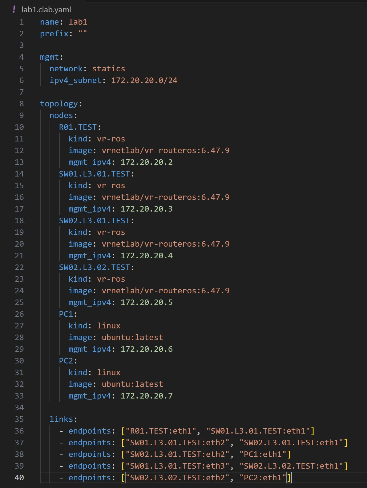
3. Схема связи построена с помощью команды `sudo containerlab graph`
   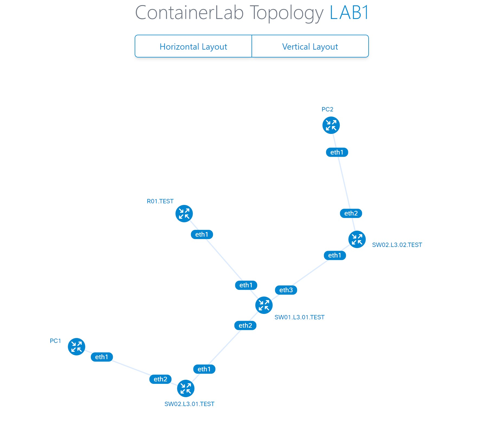
4. Проведена настройка IP-адресов и VLAN-ов, создание DHCP, устройствам выданы имена.
   1. Настройка роутера R01.TEST
      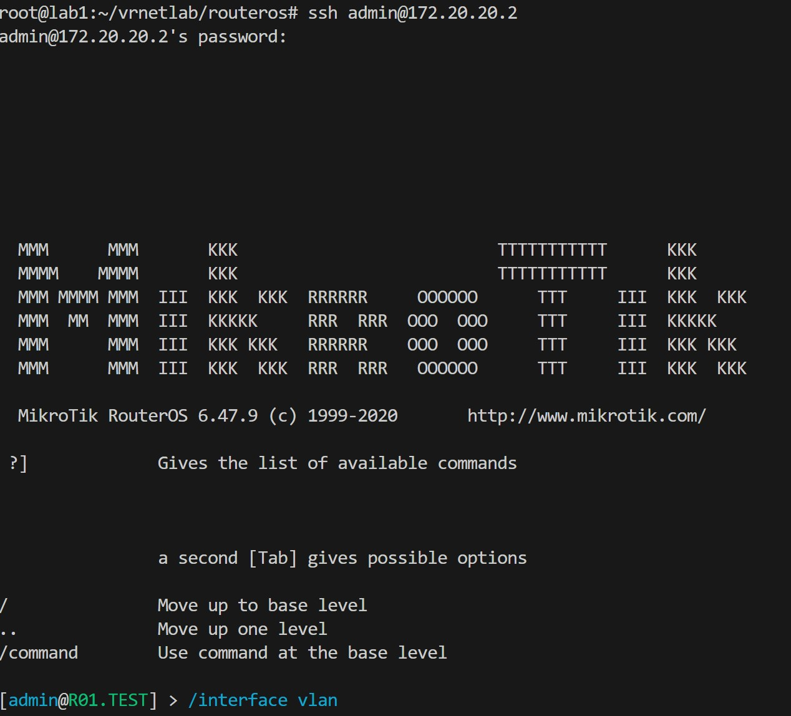
      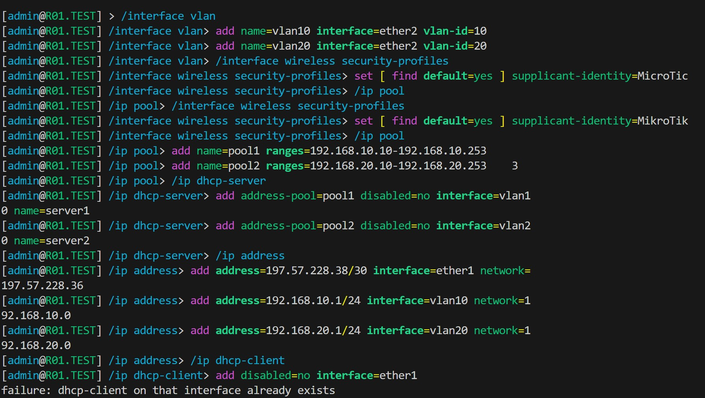
      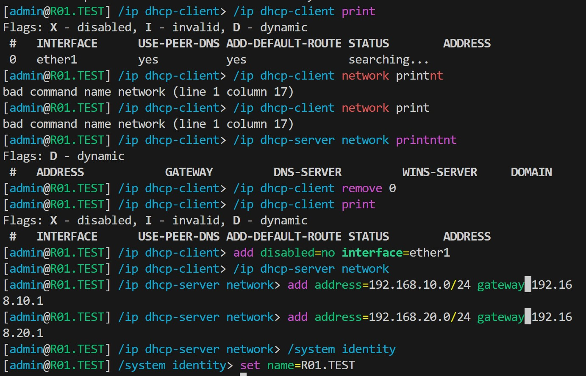
   2. Настройка маршрутизатора SW01.L3.01.TEST
      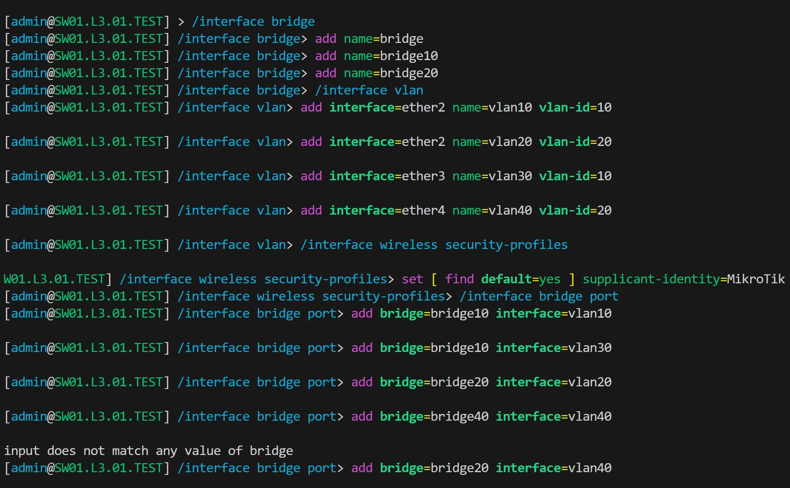
      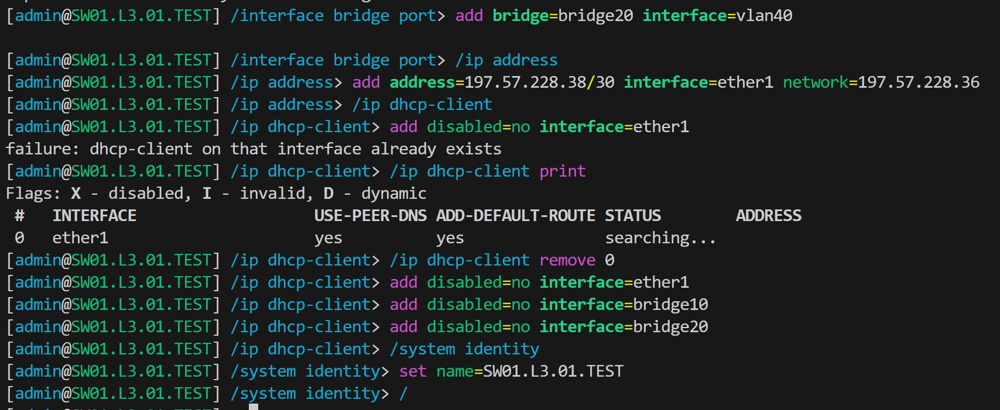
   3. Настройка маршрутизатора SW02.L3.01.TEST
      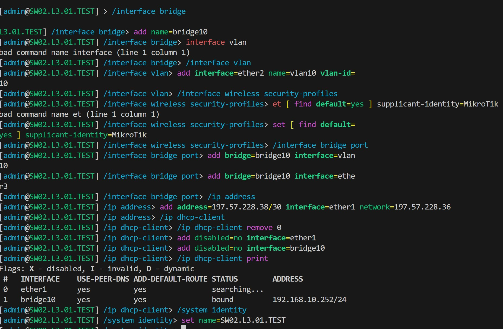
   4. Настройка маршрутизатора SW02.L3.02.TEST
      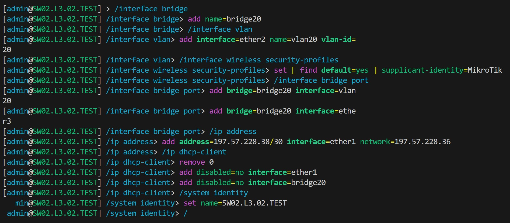
5. Результаты пингов, проверки локальной связности:
    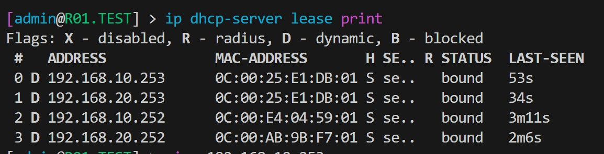
    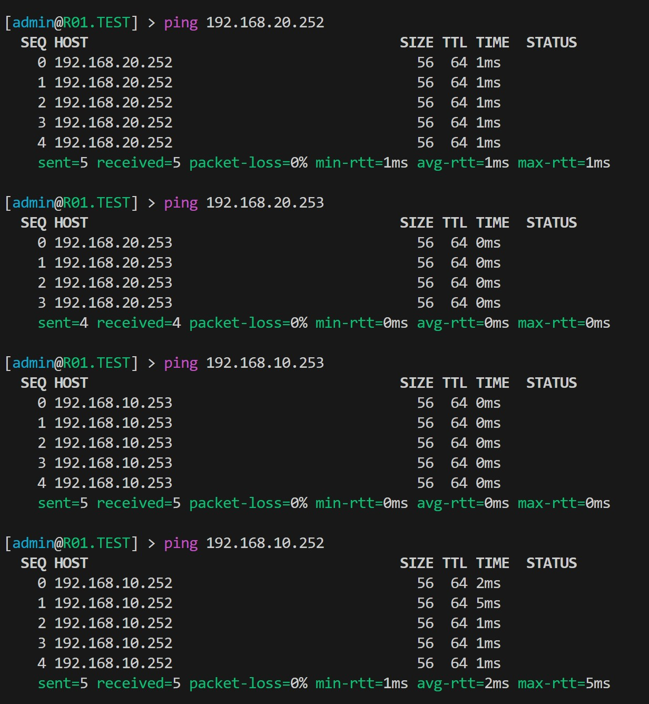
