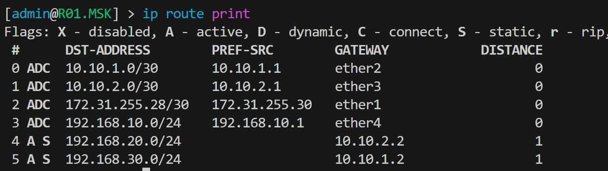
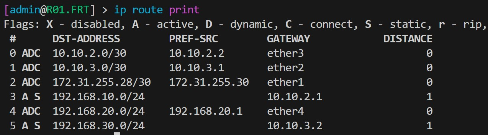
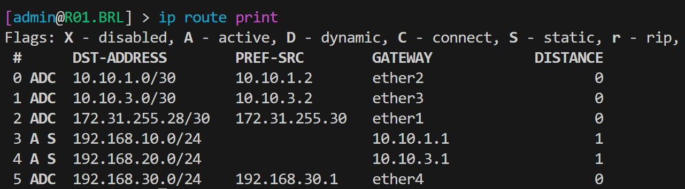
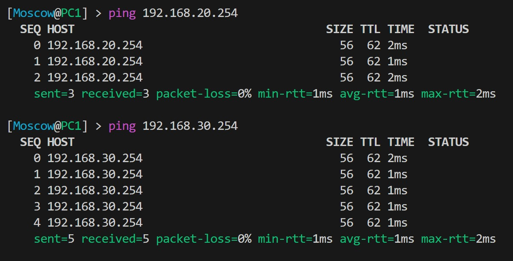
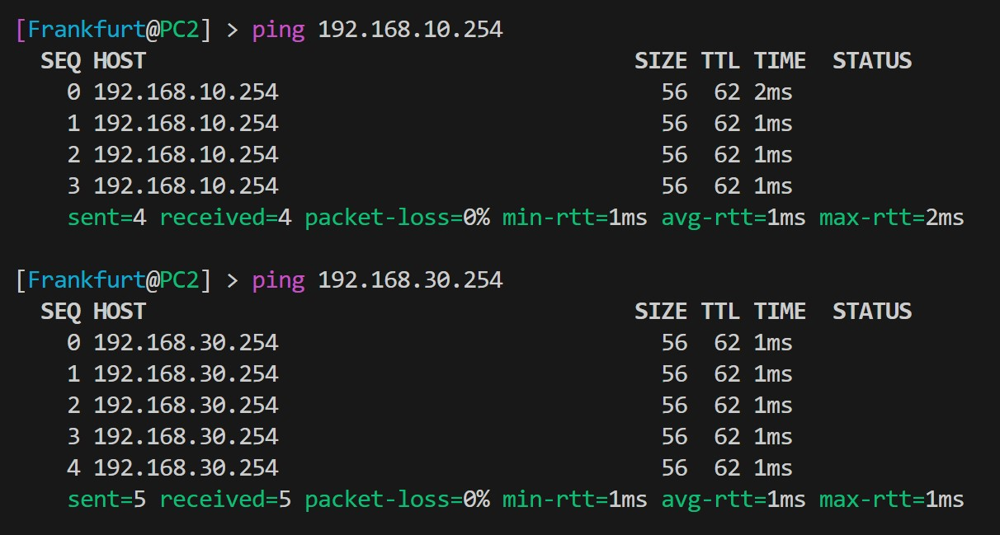
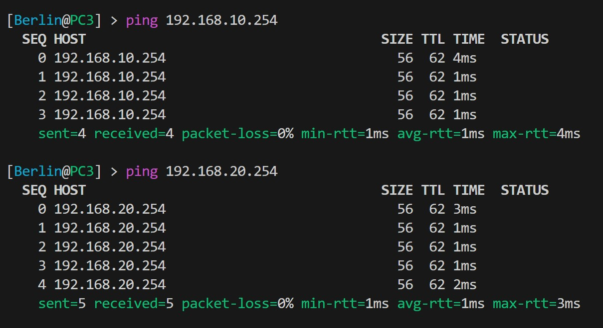

University: [ITMO University](https://itmo.ru/ru/)  
Faculty: [FICT](https://fict.itmo.ru)  
Course: [Introduction in routing](https://github.com/itmo-ict-faculty/introduction-in-routing)  
Year: 2024/2025  
Group: K3320  
Author: Shimchenko Alexandra Sergeevna   
Lab: Lab2    
Date of creation: 20.10.2024   
Date of finish: 30.10.2024


## Лабораторная работа №2 "Эмуляция распределенной корпоративной сети связи, настройка статической маршрутизации между филиалами"
### Описание работы

В данной лабораторной работе вы первый раз познакомитесь с компанией "RogaIKopita Games" LLC которая занимается разработкой мобильных игр с офисами в Москве, Франкфурте и Берлине. Для обеспечения работы своих офисов "RogaIKopita Games" вам как сетевому инженеру необходимо установить 3 роутера, назначить на них IP адресацию и поднять статическую маршрутизацию. В результате работы сотрудник из Москвы должен иметь возможность обмениваться данными с сотрудником из Франкфурта или Берлина и наоборот.

### Цель работы

Ознакомиться с принципами планирования IP адресов, настройке статической маршрутизации и сетевыми функциями устройств.

### Ход работы
1. Создан файл `network.clab.yaml`, который описывает топологию сети, состоящую из трёх маршрутизаторов и трёх ПК
```
name: lab_2
prefix: ""

mgmt: 
  network: statics
  ipv4_subnet: 172.20.20.0/24


topology:

  nodes:
    R01.MSK:
      kind: vr-ros
      image: vrnetlab/mikrotik_routeros:6.47.9
      mgmt_ipv4: 172.20.20.2

    R01.FRT:
      kind: vr-ros
      image: vrnetlab/mikrotik_routeros:6.47.9
      mgmt_ipv4: 172.20.20.3

    R01.BRL:
      kind: vr-ros
      image: vrnetlab/mikrotik_routeros:6.47.9
      mgmt_ipv4: 172.20.20.4

    PC1:
      kind: vr-ros
      image: vrnetlab/mikrotik_routeros:6.47.9
      mgmt_ipv4: 172.20.20.5

    PC2:
      kind: vr-ros
      image: vrnetlab/mikrotik_routeros:6.47.9
      mgmt_ipv4: 172.20.20.6

    PC3:
      kind: vr-ros
      image: vrnetlab/mikrotik_routeros:6.47.9
      mgmt_ipv4: 172.20.20.7


  links:
    - endpoints: ["R01.BRL:eth3", "PC3:eth1"]
    - endpoints: ["R01.FRT:eth3", "PC2:eth1"]
    - endpoints: ["R01.MSK:eth3", "PC1:eth1"]
    - endpoints: ["R01.BRL:eth2", "R01.FRT:eth1"]
    - endpoints: ["R01.FRT:eth2", "R01.MSK:eth2"]
    - endpoints: ["R01.MSK:eth1", "R01.BRL:eth1"]
```
2. Нарисована схема связи с помощью сайта `draw.io`
   
3. Настроены конфигурации сетевых устройств
* Роутер R0.MSK
```
/interface wireless security-profiles
set [ find default=yes ] supplicant-identity=MikroTik
/ip pool
add name=pool_msk ranges=192.168.10.10-192.168.10.254
/ip dhcp-server
add address-pool=pool_msk disabled=no interface=ether4 name=dhcp_msk
/ip address
add address=172.31.255.30/30 interface=ether1 network=172.31.255.28
add address=10.10.1.1/30 interface=ether2 network=10.10.1.0
add address=10.10.2.1/30 interface=ether3 network=10.10.2.0
add address=192.168.10.1/24 interface=ether4 network=192.168.10.0
/ip dhcp-client
add disabled=no interface=ether1
/ip route
add distance=1 dst-address=192.168.20.0/24 gateway=10.10.2.2
add distance=1 dst-address=192.168.30.0/24 gateway=10.10.1.2
/system identity
set name=R01.MSK
```
* Роутер R0.FRT
```
/interface wireless security-profiles
set [ find default=yes ] supplicant-identity=MikroTik
/ip pool
add name=pool_frt ranges=192.168.20.10-192.168.20.254
/ip dhcp-server
add address-pool=pool_frt disabled=no interface=ether4 name=dhcp_frt
/ip address
add address=172.31.255.30/30 interface=ether1 network=172.31.255.28
add address=10.10.2.2/30 interface=ether3 network=10.10.2.0
add address=10.10.3.1/30 interface=ether2 network=10.10.3.0
add address=192.168.20.1/24 interface=ether4 network=192.168.20.0
/ip dhcp-client
add disabled=no interface=ether1
/ip route
add distance=1 dst-address=192.168.10.0/24 gateway=10.10.2.1
add distance=1 dst-address=192.168.30.0/24 gateway=10.10.3.2
/system identity
set name=R01.FRT
```
* Роутер R0.BRL
```
/interface wireless security-profiles
set [ find default=yes ] supplicant-identity=MikroTik
/ip pool
add name=pool_brl ranges=192.168.30.10-192.168.30.254
/ip dhcp-server
add address-pool=pool_brl disabled=no interface=ether4 name=dhcp_brl
/ip address
add address=172.31.255.30/30 interface=ether1 network=172.31.255.28
add address=10.10.1.2/30 interface=ether2 network=10.10.1.0
add address=10.10.3.2/30 interface=ether3 network=10.10.3.0
add address=192.168.30.1/24 interface=ether4 network=192.168.30.0
/ip dhcp-client
add disabled=no interface=ether1
/ip route
add distance=1 dst-address=192.168.10.0/24 gateway=10.10.1.1
add distance=1 dst-address=192.168.20.0/24 gateway=10.10.3.1
/system identity
set name=R01.BRL
```
* Компьютер PC1
```
/interface wireless security-profiles
set [ find default=yes ] supplicant-identity=MikroTik
/ip address
add address=172.31.255.30/30 interface=ether1 network=172.31.255.28
/ip dhcp-client
add disabled=no interface=ether1
add disabled=no interface=ether2
/ip route
add distance=1 dst-address=10.10.1.0/30 gateway=192.168.10.1
add distance=1 dst-address=10.10.2.0/30 gateway=192.168.10.1
add distance=1 dst-address=192.168.20.0/24 gateway=192.168.10.1
add distance=1 dst-address=192.168.30.0/24 gateway=192.168.10.1
/system identity
set name=PC1
```
* Компьютер PC2
```
/interface wireless security-profiles
set [ find default=yes ] supplicant-identity=MikroTik
/ip address
add address=172.31.255.30/30 interface=ether1 network=172.31.255.28
/ip dhcp-client
add disabled=no interface=ether1
add disabled=no interface=ether2
/ip route
add distance=1 dst-address=10.10.2.0/30 gateway=192.168.20.1
add distance=1 dst-address=10.10.3.0/30 gateway=192.168.20.1
add distance=1 dst-address=192.168.10.0/24 gateway=192.168.20.1
add distance=1 dst-address=192.168.30.0/24 gateway=192.168.20.1
/system identity
set name=PC2
```
* Компьютер PC3
```
/interface wireless security-profiles
set [ find default=yes ] supplicant-identity=MikroTik
/ip address
add address=172.31.255.30/30 interface=ether1 network=172.31.255.28
/ip dhcp-client
add disabled=no interface=ether1
add disabled=no interface=ether2
/ip route
add distance=1 dst-address=10.10.1.0/30 gateway=192.168.30.1
add distance=1 dst-address=10.10.3.0/30 gateway=192.168.30.1
add distance=1 dst-address=192.168.10.0/24 gateway=192.168.30.1
add distance=1 dst-address=192.168.20.0/24 gateway=192.168.30.1
/system identity
set name=PC3
```
4. На компьютерах изменены имена пользователей и паролей. На примере PC1:
```
[admin@PC1] > user add name=Moscow password=admin group=full       
[admin@PC1] > user remove admin
```
5. Команда `ip route print` на маршрутизаторах отображает корректную таблицу маршрутизации:
    
    
    
6. Результаты пингов, проверки локальной связности:
    
    
    
### Заключение

В ходе выполнения лабораторной работы была создана и настроена сеть из трёх геораспределенных офисов с использованием маршрутизаторов и клиентских ПК. Были настроены DHCP-сервера, статическая маршрутизация, и проверена корректность работы сети с помощью пингов и трассировки. Все поставленные задачи выполнены, и сеть работает корректно, обеспечивая связь между офисами компании и клиентскими устройствами.
