University: [ITMO University](https://itmo.ru/ru/)  
Faculty: [FICT](https://fict.itmo.ru)  
Course: [Introduction in routing](https://github.com/itmo-ict-faculty/introduction-in-routing)  
Year: 2024/2025  
Group: K3320  
Author: Shimchenko Alexandra Sergeevna   
Lab: Lab3    
Date of creation: 14.11.2024   
Date of finish: 11.12.2024


## Лабораторная работа №3 "Эмуляция распределенной корпоративной сети связи, настройка OSPF и MPLS, организация первого EoMPLS"
### Описание работы

Наша компания "RogaIKopita Games" с прошлой лабораторной работы выросла до серьезного игрового концерна, ещё немного и они выпустят свой ответ Genshin Impact - Allmoney Impact. И вот для этой задачи они купили небольшую, но очень старую студию "Old Games" из Нью Йорка, при поглощении выяснилось что у этой студии много наработок в области компьютерной графики и совет директоров "RogaIKopita Games" решил взять эти наработки на вооружение. К сожалению исходники лежат на сервере "SGI Prism", в Нью-Йоркском офисе никто им пользоваться не умеет, а из-за короновируса сотрудники офиса из Санкт-Петерубурга не могут добраться в Нью-Йорк, чтобы забрать данные из "SGI Prism". Ваша задача подключить Нью-Йоркский офис к общей IP/MPLS сети и организовать EoMPLS между "SGI Prism" и компьютером инженеров в Санк-Петербурге.

### Цель работы

Изучить протоколы OSPF и MPLS, механизмы организации EoMPLS.

### Ход работы
1. Создан файл `network.clab.yaml`, который описывает топологию сети
```
name: lab3
mgmt:
    network: mgmt-net
    ipv4-subnet: 192.168.100.0/24

topology:
    kinds:
        vr-ros:
            image: vrnetlab/mikrotik_routeros:6.47.9
        linux:
            image: alpine:latest
    nodes:
        R01.SPB:
            kind: vr-ros
            mgmt-ipv4: 192.168.100.11
            startup-config: configs/spb.rsc
        R01.HKI:
            kind: vr-ros
            mgmt-ipv4: 192.168.100.12
            startup-config: configs/hki.rsc
        R01.MSK:
            kind: vr-ros
            mgmt-ipv4: 192.168.100.13
            startup-config: configs/msc.rsc
        R01.LND:
            kind: vr-ros
            mgmt-ipv4: 192.168.100.14
            startup-config: configs/lnd.rsc
        R01.LBN:
            kind: vr-ros
            mgmt-ipv4: 192.168.100.15
            startup-config: configs/lbn.rsc
        R01.NY:
            kind: vr-ros
            mgmt-ipv4: 192.168.100.16
            startup-config: configs/ny.rsc
        PC1:
            kind: linux
            binds:
              - ./configs:/configs/
        SGI_PRISM:
            kind: linux
            binds:
              - ./configs:/configs/
    links:
        - endpoints: ["R01.SPB:eth2", "R01.HKI:eth2"]
        - endpoints: ["R01.SPB:eth3", "R01.MSK:eth2"]
        - endpoints: ["R01.SPB:eth4", "PC1:eth2"]
        - endpoints: ["R01.HKI:eth3", "R01.LND:eth2"]
        - endpoints: ["R01.HKI:eth4", "R01.LBN:eth2"]
        - endpoints: ["R01.LBN:eth3", "R01.MSK:eth3"]
        - endpoints: ["R01.LBN:eth4", "R01.NY:eth3"]
        - endpoints: ["R01.NY:eth2", "R01.LND:eth3"]
        - endpoints: ["R01.NY:eth4", "SGI_PRISM:eth2"]
```
2. Нарисована схема связи с помощью сайта `draw.io`
   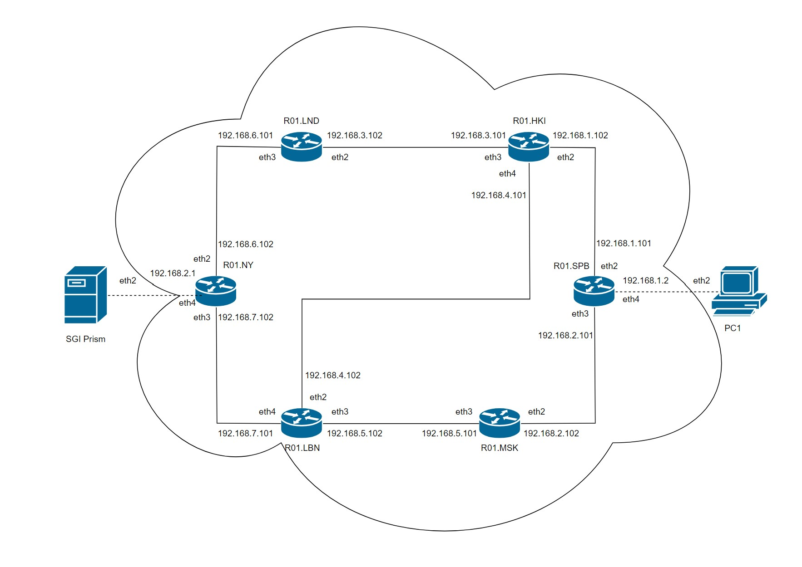
3. Настроены конфигурации сетевых устройств
Их можно посмотреть в папке [configs](configs/conf.md)  
4. Результаты настройки просмотрены с помощью команд `routing ospf neighbor print` и `mpls ldp neighbour print`
## R01.NY

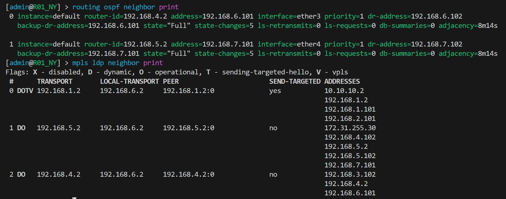

## R01.LND

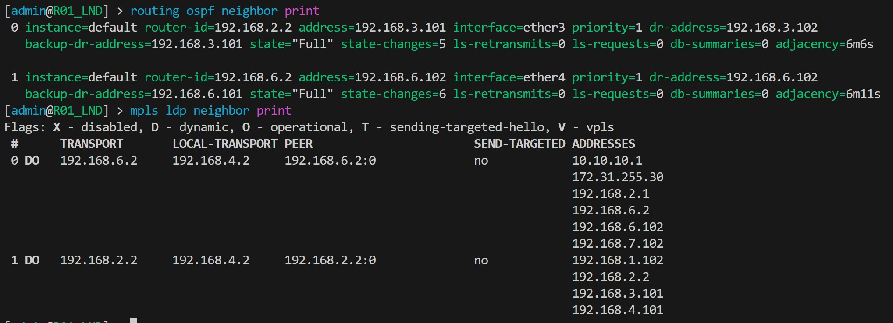

## R01.HKI

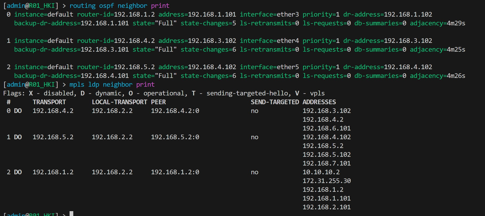

## R01.SPB

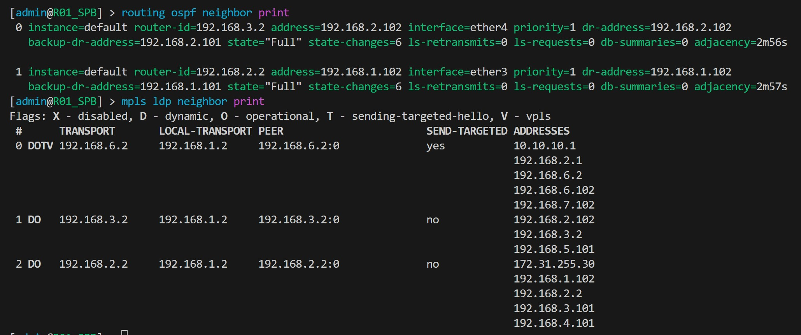

## R01.MSC

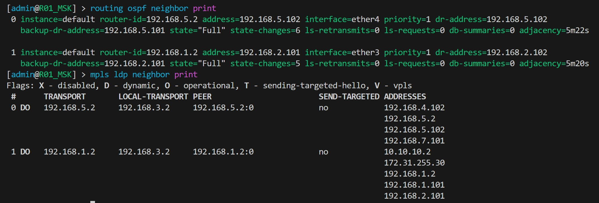

## R01.LBN

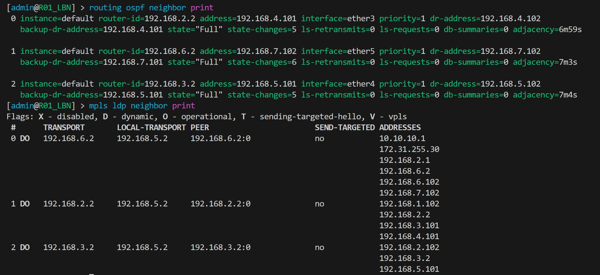
5. Путь из NY в SPB и наоборот:
    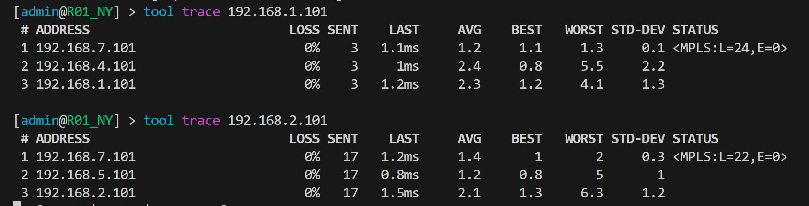
    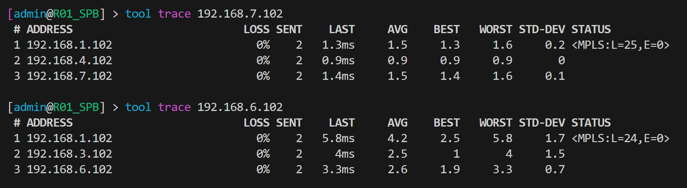
6. Результаты пингов с PC1 на SGI_PRISM и наоборот:
    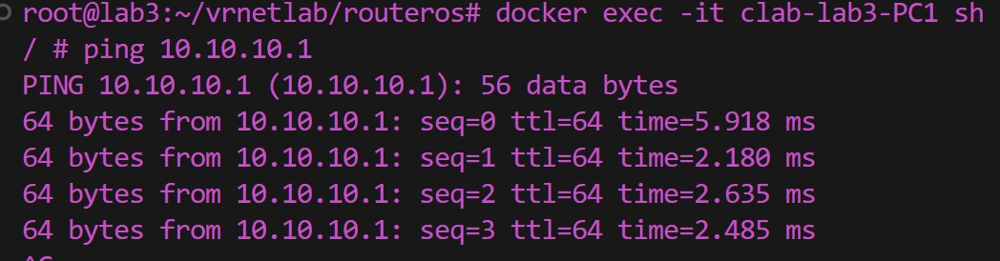
    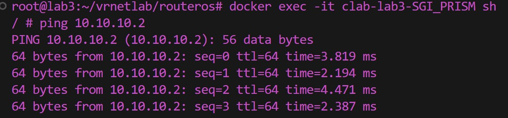
### Заключение

В ходе выполнения данной лабораторной работы я изучила протоколы OSPF и MPLS, а также механизмы организации EoMPLS.
