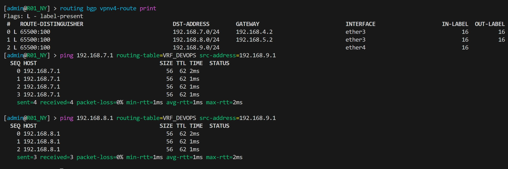
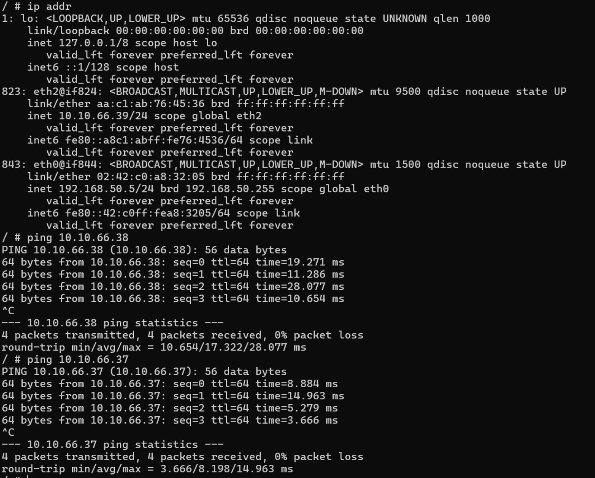

University: [ITMO University](https://itmo.ru/ru/)  
Faculty: [FICT](https://fict.itmo.ru)  
Course: [Introduction in routing](https://github.com/itmo-ict-faculty/introduction-in-routing)  
Year: 2024/2025  
Group: K3320  
Author: Shimchenko Alexandra Sergeevna   
Lab: Lab4    
Date of creation: 15.12.2024   
Date of finish: 10.01.2025


## Лабораторная работа №4 "Эмуляция распределенной корпоративной сети связи, настройка OSPF и MPLS, организация первого EoMPLS"
### Описание работы

Компания "RogaIKopita Games" выпустила игру "Allmoney Impact", нагрузка на арендные сервера возрасли и вам поставлена задача стать LIR и организовать свою AS чтобы перенести все сервера игры на свою инфраструктуру. После организации вашей AS коллеги из отдела DEVOPS попросили вас сделать L3VPN между 3 офисами для служебных нужд. (Рисунок 1) Данный L3VPN проработал пару недель и коллеги из отдела DEVOPS попросили вас сделать VPLS для служебных нужд.

### Цель работы

Изучить протоколы BGP, MPLS и правила организации L3VPN и VPLS.

### Ход работы
1. Для выполнения первой части задания создан файл `network1.clab.yaml`, который описывает топологию сети
```
name: lab4-1

mgmt:
    network: mgmt-net
    ipv4-subnet: 192.168.50.0/24

topology:
    kinds:
        vr-ros:
            image: vrnetlab/mikrotik_routeros:6.47.9
        linux:
            image: alpine:latest
    nodes:
        R01_spb:
            kind: vr-ros
            mgmt-ipv4: 192.168.50.11
            startup-config: configs/spb_1.rsc
        R01_hki:
            kind: vr-ros
            mgmt-ipv4: 192.168.50.12
            startup-config: configs/hki_1.rsc
        R01_lbn:
            kind: vr-ros
            mgmt-ipv4: 192.168.50.13
            startup-config: configs/lbn_1.rsc
        R01_svl:
            kind: vr-ros
            mgmt-ipv4: 192.168.50.14
            startup-config: configs/svl_1.rsc
        R01_lnd:
            kind: vr-ros
            mgmt-ipv4: 192.168.50.15
            startup-config: configs/lnd_1.rsc
        R01_ny:
            kind: vr-ros
            mgmt-ipv4: 192.168.50.16
            startup-config: configs/ny_1.rsc
        PC1:
            kind: linux
            binds:
              - ./configs:/configs/
        PC2:
            kind: linux
            binds:
              - ./configs:/configs/
        PC3:
            kind: linux
            binds:
              - ./configs:/configs/
    links:
        - endpoints: ["R01_spb:eth2", "R01_hki:eth4"]
        - endpoints: ["R01_spb:eth3", "PC1:eth2"]
        - endpoints: ["R01_hki:eth2", "R01_lbn:eth3"]
        - endpoints: ["R01_hki:eth3", "R01_lnd:eth2"]
        - endpoints: ["R01_lnd:eth3", "R01_lbn:eth2"]
        - endpoints: ["R01_lnd:eth4", "R01_ny:eth2"]
        - endpoints: ["R01_lbn:eth4", "R01_svl:eth2"]
        - endpoints: ["R01_ny:eth3", "PC2:eth2"]
        - endpoints: ["R01_svl:eth3", "PC3:eth2"]

```
2. Нарисована схема связи с помощью сайта `draw.io`
   
3. Настроены конфигурации сетевых устройств. Их можно посмотреть в папке [configs](configs/conf1.md)

5. Результаты настройки просмотрены с помощью команд `routing bgp vpnv4-route print` и `ping ... routing-table=... src-address=...`

## R01.SPB


## R01.SVL


## R01.NY



5. Для выполнения второй части задания изменён файл `network2.clab.yaml`, который описывает топологию сети
```
name: lab4-2

mgmt:
    network: mgmt-net
    ipv4-subnet: 192.168.50.0/24

topology:
    kinds:
        vr-ros
            image: vrnetlab/mikrotik_routeros:6.47.9
        linux:
            image: alpine:latest
    nodes:
        R01_spb:
            kind: vr-ros
            mgmt-ipv4: 192.168.50.21
            startup-config: configs/spb_2.rsc
        R01_hki:
            kind: vr-ros
            mgmt-ipv4: 192.168.50.22
            startup-config: configs/hki_2.rsc
        R01_lbn:
            kind: vr-ros
            mgmt-ipv4: 192.168.50.23
            startup-config: configs/lbn_2.rsc
        R01_svl:
            kind: vr-ros
            mgmt-ipv4: 192.168.50.24
            startup-config: configs/svl_2.rsc
        R01_lnd:
            kind: vr-ros
            mgmt-ipv4: 192.168.50.25
            startup-config: configs/lnd_2.rsc
        R01_ny:
            kind: vr-ros
            mgmt-ipv4: 192.168.50.26
            startup-config: configs/ny_2.rsc
        PC1:
            kind: linux
            binds:
              - ./configs:/configs/
        PC2:
            kind: linux
            binds:
              - ./configs:/configs/
        PC3:
            kind: linux
            binds:
              - ./configs:/configs/
    links:
        - endpoints: ["R01_spb:eth2", "R01_hki:eth4"]
        - endpoints: ["R01_spb:eth3", "PC1:eth2"]
        - endpoints: ["R01_hki:eth2", "R01_lbn:eth3"]
        - endpoints: ["R01_hki:eth3", "R01_lnd:eth2"]
        - endpoints: ["R01_lnd:eth3", "R01_lbn:eth2"]
        - endpoints: ["R01_lnd:eth4", "R01_ny:eth2"]
        - endpoints: ["R01_lbn:eth4", "R01_svl:eth2"]
        - endpoints: ["R01_ny:eth3", "PC2:eth2"]
        - endpoints: ["R01_svl:eth3", "PC3:eth2"]
```
6. Перенастроены конфигурации сетевых устройств. Их можно посмотреть в папке [configs](configs/conf2.md)  

7. Команда ping, отправленная с PC1 на PC2 и PC3 прошла успешно
   
   
### Заключение

В ходе выполнения лабораторной работы по созданию IP/MPLS сети связи для компании "RogaIKopita Games" были изучены и применены на практике протоколы BGP, MPLS, а также правила организации L3VPN и VPLS. 

Были выполнены все необходимые шаги для создания собственной AS, что позволило перенести все сервера игры "Allmoney Impact" на собственную инфраструктуру компании.

В первой части работы была настроена L3VPN между тремя офисами компании. Для этого были настроены iBGP с кластером Route Reflector, VRF на трех маршрутизаторах, а также RD и RT. Проверка связности между VRF подтвердила корректность настройки.

Во второй части работы была выполнена настройка VPLS на тех же трех маршрутизаторах. Для этого были разобраны VRF и настроены VPLS-соединения. Также была выполнена настройка IP-адресации на ПК в одной сети и проверена связность.
